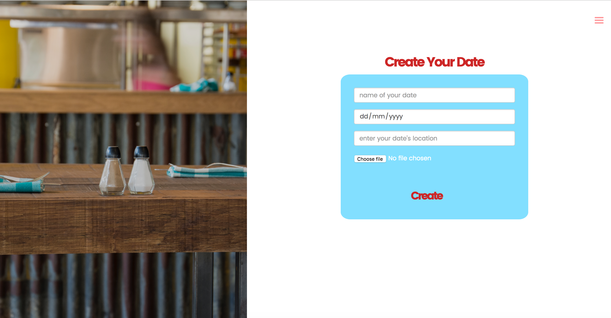
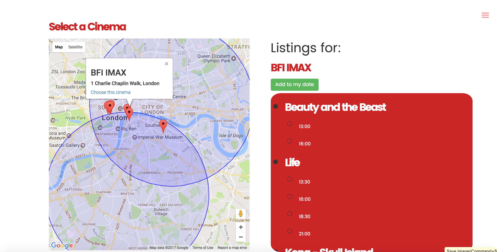

# GA WDI London, Project 3, Mar 2017.
# Date Night App.

## Alice Marshall, Adrian Welch, Sarah Miller

Date night is a mean stack app, intended for people to plan a "date night", it allows the user to enter two locations and to locate cinemas that are located within a set distance from those two points. Once a cinema is selected the user can then see the films that are playing on a given day and select a film and the time of the showing. The user can then select a restaurant near to the cinema selected. Node Mailer has been integrated to allow the user to email the details of their night.

The app has two database collections, dateNight, is created by the user with the name their date's name and location and picture. The second collection is the User, which is used for authentication and to display a user profile page with details of all the date's created by that user. All CRUD actions are available on both collections.  

The app has been built following the RESTful model in both the back end, which was built in Express, and the Front end, built in AngularJS. Several APIs have been consumed in order to add functionality to the app, these are Google Maps, Autocomplete, Google Places and CineList to provide the listing information. The app requires the users to register and log in and uses JWT to complete the authentication, additionally OAuth is available via Facebook.. Image upload has been implemented using AWS. Node Mailer was used to send emails to the user with the details of their date.    

<h3> Technologies used;</h3>
* Date Night is a MEAN stack application.
* The api is built in Node.js with Express.
* A mongo database was used to store the data, with mongoose used to create models within express.
* Pictures are base64 encoded and stored using the AWS S3 service.
* Authentication uses JWT with Satellizer and BCrypt.
* OAuth via Facebook was implemented using Satellizer.
* AngularJS was used on the front end to direct the API data and render the views.
* UI Router was used to build multiple pages.
* Google's autocomplete, Maps and Places APIs were consumed, as was CineList Api.
* NodeMailer was used to send email notifications to users.
* UI Bootstrap was used to provide grid layouts and additional functionality including Modals.
* Styles were written in Sass.
* Gulp was used as taskrunner.
* The google web fonts 'Poppins' and 'Roboto' were used to style the app, font-awesome was used to supply logos.
* A high resolution images are from Unsplash.com.
* Babel is used minify and convert the Javascript to ES5.
* The app is deployed via Heroku. (https://powerful-reef-28263.herokuapp.com/)

## Wireframes
Wire framing was done in Balsamiq;

The end app is very close to the wireframing, and this was an essential step in planning the routes.

In addition to wire framing, planning each of the tasks was done in Trello, the EleGantt plug in was also utilised in order to keep track of project timings. Trello was an essential part of ensuring the group project ran smoothly.

## User Journey and Site Functionality
The user flow through the site is as follows;

The homepage is a splash image, from here the user can register to use the site, or login from the navigation bar. Registration requires the user to input their address using google autocomplete, and the Latitiude and Longitiude are stored in the record.

Once logged in, or registered the the user is redirected to their User profile page, which shows all the dates they have created using the site.  

The New date route, allows the user to create a new date using a form, including adding a location using google autocomplete, which redirects to the show page for that date, from here the user can redirect to the google maps pages where they can select a cinema and a film to add to their date.

This page is essentially an edit page and makes several API requests;
* Firstly to google maps to display the map in the vicinity of the user's address (added on registration).
* The second GET request is to google places to get the cinemas within a radius of both the user and the date's addresses, custom javascript filters the results so that only the cinemas closest to the midpoint between the user and date's location display. The slider allows the radius of the search location to be changed.
* The user then selects a cinema and this makes a GET request to the CineList API for the movie showtimes for that cinema.

Selecting the showtime and clicking "add to my date" selects the film, time and cinema name updates the record and redirects the user back to the show page.

From the show page the user can then opt to select a restaurant, this option redirects the user to a further Edit page. This displays all the restaurants near to the cinema selected, based on a GET request to the Google Places API based on the location of the cinema that has been selected.

Once the date record has been populated the user can further edit the date record by adding comments and a rating for the date.

All the date records created by all users are available on the date Index page, including the comments, which may provide useful information to other users.

<h3>Unsolved Problems </h3>
* Ideally the select restaurants option on the date show page would not display until the cinema had been selected.

* The team had intended to use the CityMapper API to calculate journey times using public transport between the two locations, however there was not time to incorporate this into the app.

* Some of the API requests take a little time to display, a loading button would improve the user experience for these pages.

<h3>Challenges </h3>
Writing the search function for displaying the cinemas within a certain radius of the locations was a complex task, and it would not have been possible to implement this functionality within the timeframe if this project had not been a group project.

Limits to API requests also proved an issue in the testing phase, as limits would frequently be exceeded adding extra time to the development.
